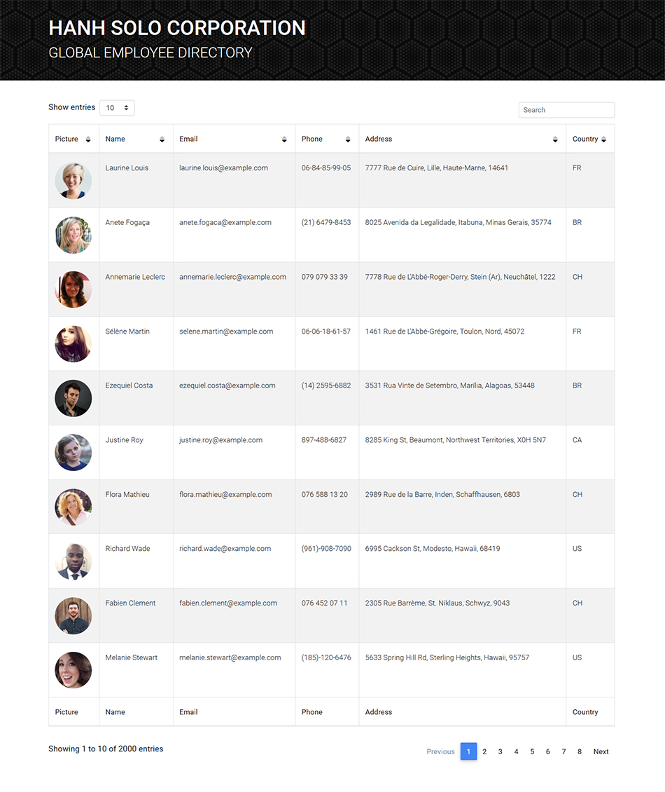

# Employee Directory

## Overview
Employers can view their entire employee directory at once so they can have quick access to their information. They can sort the table alphabetically or numerically using the arrows at the top of each column. Additionally, they can also filter employee(s) by name, city, zipcode, country, etc. using the search bar at the top of the page

This employee directory was created using React. Random users are generated from [Random User API](https://randomuser.me/)

## Screenshot and Demo

## Links

* [Deployed application](https://hanh-employee-directory.herokuapp.com/)
* [Github repository](https://github.com/hanhle1989/React-Employee-Directory)